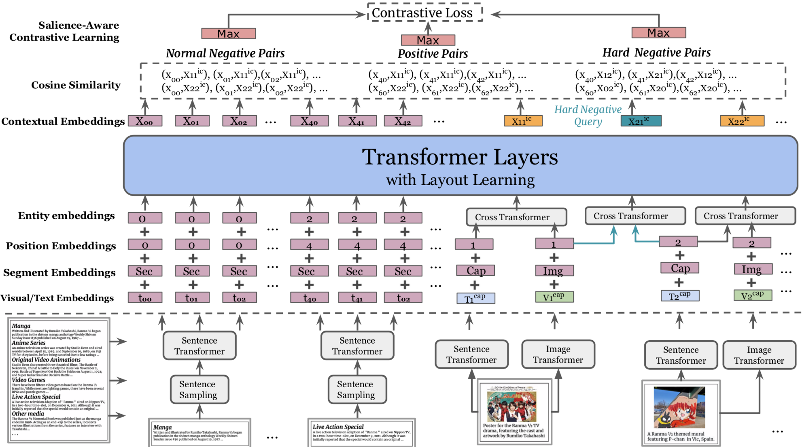
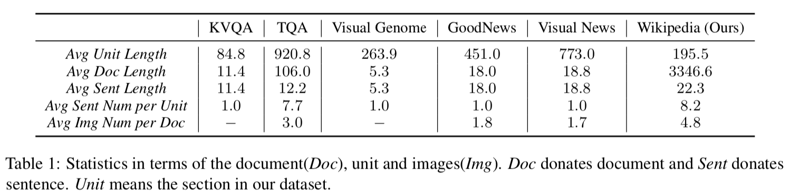
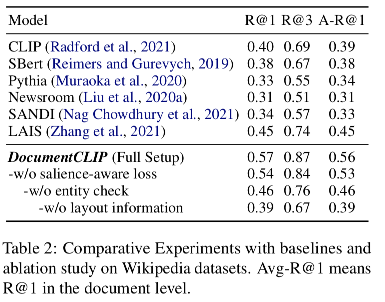

# DocumentCLIP: Linking Figures and Main Body Text in Reflowed Documents[ICLRAI'23]
Fuxiao Liu, Hao Tan, Chris Tensmeyer

## Citing
If you find our paper/code useful, please consider citing:

```
@article{liu2023documentclip,
  title={DocumentCLIP: Linking Figures and Main Body Text in Reflowed Documents},
  author={Liu, Fuxiao and Tan, Hao and Tensmeyer, Chris},
  journal={arXiv preprint arXiv:2306.06306},
  year={2023}
}
```
Vision-language pretraining models have achieved great
success in supporting multimedia applications by under-
standing the alignments between images and text. While
existing vision-language pretraining models primarily focus
on understanding single image associated with a single piece
of text, they often ignore the alignment at the intra-document
level, consisting of multiple sentences with multiple images.
In this work, we propose DocumentCLIP, a salience-aware
contrastive learning framework to enforce vision-language
pretraining models to comprehend the interaction between
images and longer text within documents. Our model is bene-
ficial for the real-world multimodal document understanding
like news article, magazines, product descriptions, which
contain linguistically and visually richer content. To the
best of our knowledge, we are the first to explore multimodal
intra-document links by contrastive learning. In addition, we
collect a large Wikipedia dataset for pretraining, which pro-
vides various topics and structures. Experiments show Docu-
mentCLIP not only outperforms the state-of-the-art baselines
in the supervised setting, but also achieves the best zero-shot
performance in the wild after human evaluation.

## Model Preview:


## Requirements
Clone this repo and build the environment

```
conda env create -f DCLIP.yml --name DCLIP
conda activate DCLIP
```

## Data

- Download the latest Wikipedia<sup>[1](#footnote1)</sup> dump `enwiki-*-pages-articles.xml.bz2` from https://dumps.wikimedia.org/backup-index.html.

### Data Preprocess
Follow the instruction in [preprocess.txt](./Data/instruction.txt)

The final output of this tool is a collection of Wikipedia articles, which are separated by directories, i.e., one directory per one article. The structure in each directory is below:

```
${ARTICLE_NAME}/
  |-- doc.xml : an article text marked with section and image position information
  |-- doc.json : JSON format converted from doc.xml
  |-- *.jpeg : image files in JPEG format
  |-- info/ : additional information stored
        |-- *.license : license information of images
        |-- removed.json : modified parts from the original text
``` 

### Statistic of Our Dataset


## Model Running

### Sample single-process running code:
```bash
CUDA_VISIBLE_DEVICES=0 python -m training1.main     --save-frequency 1     --zeroshot-frequency 1     --report-to tensorboard     --train-data="./data/validation_wiki.csv"      --val-data="./data/validation_wiki.csv"      --csv-img-key filepath     --csv-caption-key title     --warmup 10000     --batch-size=32     --lr=0.001    --wd=0.1     --epochs=30     --workers=8
```

Note: `imagenet-val` is the path to the *validation* set of ImageNet for zero-shot evaluation, not the training set!
You can remove this argument if you do not want to perform zero-shot evaluation on ImageNet throughout training. 

### Multi-GPU with Single-Node

We make use of `torchrun` to launch distributed jobs. The following launches a
a job on a node of 4 GPUs:

```bash
    
torchrun --nproc_per_node=4 --rdzv_endpoint=$HOSTE_NODE_ADDR -m training1.main \ --train-data="./data/validation_wiki.csv"      --val-data="./data/validation_wiki.csv"   --warmup 10000     --batch-size=64    --lr=0.001   --wd=0.1     --epochs=30     --workers=4
```
### Inference
The checkpoint of our model will be shared upon request. please email: fl3es@umd.edu.

### Experiment Results


```
